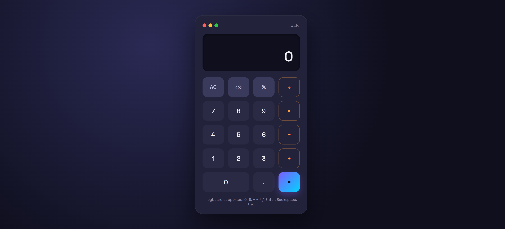

# Calculator App

A modern and responsive calculator application built with HTML, CSS, and JavaScript. It features real-time calculations, keyboard support, and a clean, intuitive user interface.

## ✨ Features

- Basic arithmetic operations (+, −, ×, ÷, %)
- Real-time calculations
- Keyboard support
- Responsive design
- Clean and modern UI

## 🛠️ Technologies Used

- HTML5
- CSS3
- JavaScript

## 📸 Preview



## 🚀 Live Demo

🔗  https://shahdessam2004.github.io/CodeAlpha_Calculator/

## 📂 Project Structure

```text
Calculator/
│── index.html
│── style.css
│── script.js
│── README.md
└── images/
    └── preview.png
```

## 👩‍💻 Author

**Shahd Essam**

- GitHub: https://github.com/ShahdEssam2004
- LinkedIn: https://www.linkedin.com/in/shahdessam/
